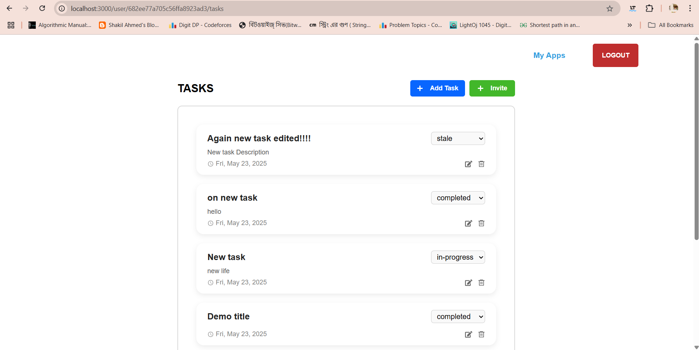

# 🧩 Next.js Task App – Frontend

A frontend application built with **Next.js App Router** for managing collaborative ToDo applications.

**See demo video**: [https://drive.google.com/file/d/1bfJROiBK0YJEFsJYBS8FDJV1lG6BgVen/view?usp=sharing](https://drive.google.com/file/d/1bfJROiBK0YJEFsJYBS8FDJV1lG6BgVen/view?usp=sharing)



---
## Getting Started

First, clone the repository [https://github.com/rafi-ruetcse17/frontend.git](https://github.com/rafi-ruetcse17/frontend.git)

Open terminal (i.e. VS Code) and install dependencies:
```
cd frontend
npm install
```

Run the development server:

```bash
npm run dev
# or
yarn dev
# or
pnpm dev
# or
bun dev
```

Open [http://localhost:3000](http://localhost:3000) with your browser to see the result.


## 🔐 1. Authentication

- Users can **Sign Up** using name, email, and password.
- Users can **Log In** using email and password.
- These are **public API routes**.
- Session is managed using **NextAuth (JWT strategy)**.
- **Axios interceptor** is used to attach token automatically to every REST API request.

### Critical Thinking Outcome:
1. **Authorization header** is automatically sent for all protected routes so that auth guard can easily be implemented on server.

**See Authentication Demo**: [https://drive.google.com/file/d/16zhefyYWiigrj6W3etrtZtN4lxkzdVDO/view?usp=sharing](https://drive.google.com/file/d/16zhefyYWiigrj6W3etrtZtN4lxkzdVDO/view?usp=sharing)

---

## 🧭 2. Navigation

- All authenticated pages include a **navbar** from `layout.js` under `/user/*`.
- Navbar provides:
  - A **Logout** button.
  - A button to return to the **App List Page**.

### Critical Thinking Outcome:
1. Button to return **App List Page** is skipped on app list page as it is unnecessary.
---

## 📋 3. ToDo App List Page  
**Route**: `/user`

- Landing page after login.
- Displays **all apps** the user has access to.
- Each app card shows:
  - **Title**
  - **Created time**
  - **User role** (owner/collaborator)
- Clicking on an app redirects to its **task list**.

### Critical Thinking Outcome:
1. Apps are **sorted by latest creation time** for quick access to newly created ones to enhance **user experience**.
2. Deletion is protected with a modal to avoid **accidental removal**.

**See Demo**: [https://drive.google.com/file/d/1QWmEQyGzy47ByBKo_LoZMY47XSwE0iEN/view?usp=sharing](https://drive.google.com/file/d/1QWmEQyGzy47ByBKo_LoZMY47XSwE0iEN/view?usp=sharing)

---

## 📋 4. Create Todo App

**Route:** `/user/apps/create`

- User can input the **App Title** to create a new ToDo App.
- Upon successful creation, user is **redirected** to the App List page.

**Implementation Notes:**

- `react-hook-form` is used to manage form state and validation efficiently.
- Form includes error handling and loading states for better UX.

**See app creation demo**: [https://drive.google.com/file/d/1BudjZZ6lvgnGsyYoIBk2DSP249QkfYcN/view?usp=drive_link](https://drive.google.com/file/d/1BudjZZ6lvgnGsyYoIBk2DSP249QkfYcN/view?usp=drive_link)

---

## 📋 5. Tasks List of an App

**Route:** `/user/[appId]/tasks/[pageNumber]`

- Each task includes a **status**: `in progress`, `completed`, or `stale`.
- **Users with Editor or Owner** roles can:
  - Add/Edit/Delete task
  - Change task status
- **Users with View-only** access can only see the task list.
- **App Owners** can invite other users and assign them a role (`viewer`, `editor`).

### Critical Thinking Outcome:

- **Pagination** is implemented to improve API performance and reduce page load time.
- Tasks are **sorted by latest creation time** for better visibility of recent activity.
- **Confirmation modal** appears before task deletion to prevent accidental removals.
- Tasks status are managed through **seperate enum** file for code reusability.

**See task list demo**: [https://drive.google.com/file/d/1QbimrakflqwfaEFzrIUCjtunDCRv1PGv/view?usp=sharing](https://drive.google.com/file/d/1QbimrakflqwfaEFzrIUCjtunDCRv1PGv/view?usp=sharing)

---

## 📝 6. Create a New Task  
**Route:** `/user/[appId]/tasks/create`

- Input **title** and **description**
- Only users with `owner` or `editor` role can access this page  
- On success, redirects to the **Task List** page

**Implementation notes**:
- Built with `react-hook-form` for form state management and validation.
- Create button will not be visible to the users with `viewer` role.

**See task creation demo**: [https://drive.google.com/file/d/1WgneOeq1-ayh03KS5Wnd4hut21v8tQnQ/view?usp=sharing](https://drive.google.com/file/d/1WgneOeq1-ayh03KS5Wnd4hut21v8tQnQ/view?usp=sharing)

---

## ✏️ 7. Edit a Task  
**Route:** `/user/[appId]/tasks/edit/[taskId]`

- Pre-fills existing **title** and **description**
- Only users with `owner` or `editor` role can edit  
- On success, redirects to the **Task List** page

**Implementation notes**:
- Uses `react-hook-form` for handling form and validations
- Form fields are pre-populated using task data from API
- Access control: Edit button is hidden for `viewer` role users

**See edit a task demo**: [https://drive.google.com/file/d/1s3i6plzLOKcxzoMU4fSssnRV-PPYiL4P/view?usp=sharing](https://drive.google.com/file/d/1s3i6plzLOKcxzoMU4fSssnRV-PPYiL4P/view?usp=sharing)

---

## 🔄 8. Change Task Status  
- Accessible from **Task List** page  
- Opens a **modal** to change task status (`in progress`, `completed`, `stale`)  
- Only users with `owner` or `editor` role can perform this action

**Implementation notes**:
- Status options are derived from a shared `enum` for consistency
- Action is confirmed via modal to avoid accidental updates

**See task status change demo**: [https://drive.google.com/file/d/10fTY6OlGiJBJqfZbxEC_AgN8be5ESVD7/view?usp=sharing](https://drive.google.com/file/d/10fTY6OlGiJBJqfZbxEC_AgN8be5ESVD7/view?usp=sharing)


---

## 🗑️ 9. Delete Task  
- Available on each task card  
- Opens a **confirmation modal** before deletion  
- Only users with `owner` or `editor` role can delete

**Implementation notes**:
- Tasks are removed via a secure API call
- Modal ensures users confirm before irreversible deletion

**See delete a task demo**: [https://drive.google.com/file/d/1NFow2SEHe5UHehNqyMzlSsfa2-CUidK8/view?usp=sharing](https://drive.google.com/file/d/1NFow2SEHe5UHehNqyMzlSsfa2-CUidK8/view?usp=sharing)

---

## 👥 10. Invite User  
- Button visible only to **App Owners**  
- Opens a **modal** to input user email and assign a role (`viewer`, `editor`)  
- Sends an invite and assigns permission on success

**Implementation notes**:
- Uses form with validation inside modal
- API ensures that only the `owner` can send invites

**See invite user demo**: [https://drive.google.com/file/d/11N-TQz7EuY2BhYVVcX64HHnOe7SMIPOv/view?usp=sharing](https://drive.google.com/file/d/11N-TQz7EuY2BhYVVcX64HHnOe7SMIPOv/view?usp=sharing)

---
